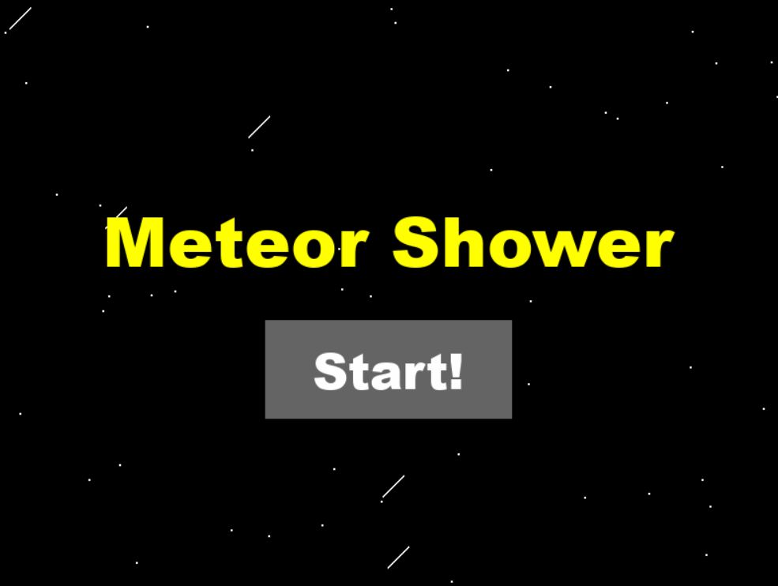

# Meteor Shower
Meteor Shower is a little game made using Python and PyGame

*Context*
- I decided it would be fun to try and create a small game as fast as possible using PyGame. I made this little application in less than a day, and named it Meteor Shower

*Premise*
- You are little green cube! Your goal? Avoid the falling, spinning meteors coming your way!
- Survive as long as possible without dying!

*Physics*
- Meteor Shower uses a few simple physics concepts for the player
- Kinematics and freefall gravity drive the player to be movable. This includes forces, acceleration, and velocity
- Accurate Friction Force formula is used to slow the player on the surface using an opposing force vector!

